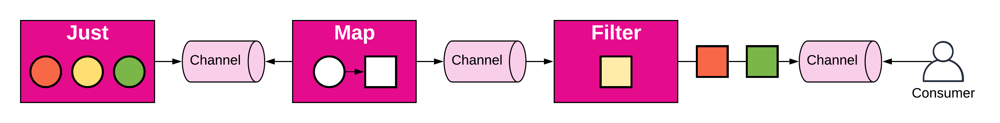

# RxGo

Reactive Extensions for the Go Language

## Getting Started

[ReactiveX](http://reactivex.io/), or Rx for short, is an API for programming with observable streams. This is the official ReactiveX API for the Go language.

**ReactiveX** is a new, alternative way of asynchronous programming to callbacks, promises and deferred. It is about processing streams of events or items, with events being any occurrences or changes within the system. A stream of events is called an [observable](http://reactivex.io/documentation/contract.html).

An operator is basically a function that defines an observable, how and when it should emit data. The list of operators covered is available [here](README.md#operators).

## RxGo

The **RxGo** implementation is based on the idea of [pipelines](https://blog.golang.org/pipelines). In a nutshell, a pipeline is a series of stages connected by channels, where each stage is a group of goroutines running the same function.

Let's check at a concrete example with each blue box being an operator:
* We create a static observable based on a fixed list of items using the `Just` operator.
* We define a transformation function using the `Map` operator (a circle into a square).
* We filter each red square using the `Filter` operator.

This stream produced in the target channel two items (a yellow and a green square).
Each operator is a transformation stage connected by channels. By default, everything is sequential. Yet, we can easily leverage modern CPU architectures by defining multiple instances of the same operator (each operator instance being a goroutine connected to a common channel).

## Observable Types

TODO

## Supported Operators in RxGo

### Creating Observables
* [Empty/Never](http://reactivex.io/documentation/operators/empty-never-throw.html) — create Observables that have very precise and limited behavior
* FromChannel — create an Observable based on a lazy channel
* FromEventSource — create an Observable based on an eager channel
* FromSlice — create an Observable from a slice
* [Interval](http://reactivex.io/documentation/operators/interval.html) — create an Observable that emits a sequence of integers spaced by a particular time interval
* [Just](http://reactivex.io/documentation/operators/just.html) — convert a set of objects into an Observable that emits that or those objects
* JustItem — convert one object into an Observable that emits this object
* [Range](http://reactivex.io/documentation/operators/range.html) — create an Observable that emits a range of sequential integers
* [Repeat](http://reactivex.io/documentation/operators/repeat.html) — create an Observable that emits a particular item or sequence of items repeatedly
* [Start](http://reactivex.io/documentation/operators/start.html) — create an Observable that emits the return value of a function
* [Timer](http://reactivex.io/documentation/operators/timer.html) — create an Observable that emits a single item after a given delay

### Transforming Observables
* [BufferWithCount/BufferWithTime/BufferWithTimeOrCount](http://reactivex.io/documentation/operators/buffer.html) — periodically gather items from an Observable into bundles and emit these bundles rather than emitting the items one at a time
* [FlatMap](http://reactivex.io/documentation/operators/flatmap.html) — transform the items emitted by an Observable into Observables, then flatten the emissions from those into a single Observable
* [Map](http://reactivex.io/documentation/operators/map.html) — transform the items emitted by an Observable by applying a function to each item
* Marshal - transform the items emitted by an Observable by applying a marshalling function to each item
* [Scan](http://reactivex.io/documentation/operators/scan.html) — apply a function to each item emitted by an Observable, sequentially, and emit each successive value
* Unmarshal - transform the items emitted by an Observable by applying a unmarshalling function to each item

### Filtering Observables
* [Distinct/DistinctUntilChanged](http://reactivex.io/documentation/operators/distinct.html) — suppress duplicate items emitted by an Observable
* [ElementAt](http://reactivex.io/documentation/operators/elementat.html) — emit only item n emitted by an Observable
* [Filter](http://reactivex.io/documentation/operators/filter.html) — emit only those items from an Observable that pass a predicate test
* [First/FirstOrDefault](http://reactivex.io/documentation/operators/first.html) — emit only the first item, or the first item that meets a condition, from an Observable
* [IgnoreElements](http://reactivex.io/documentation/operators/ignoreelements.html) — do not emit any items from an Observable but mirror its termination notification
* [Last/LastOrDefault](http://reactivex.io/documentation/operators/last.html) — emit only the last item emitted by an Observable
* [Sample](http://reactivex.io/documentation/operators/sample.html) — emit the most recent item emitted by an Observable within periodic time intervals
* [Skip](http://reactivex.io/documentation/operators/skip.html) — suppress the first n items emitted by an Observable
* [SkipLast](http://reactivex.io/documentation/operators/skiplast.html) — suppress the last n items emitted by an Observable
* [Take](http://reactivex.io/documentation/operators/take.html) — emit only the first n items emitted by an Observable
* [TakeLast](http://reactivex.io/documentation/operators/takelast.html) — emit only the last n items emitted by an Observable

### Combining Observables
* [CombineLatest](http://reactivex.io/documentation/operators/combinelatest.html) — when an item is emitted by either of two Observables, combine the latest item emitted by each Observable via a specified function and emit items based on the results of this function
* [Merge](http://reactivex.io/documentation/operators/merge.html) — combine multiple Observables into one by merging their emissions
* Scatter - combine scatter functions emitting items into one Observable
* [StartWithIterable](http://reactivex.io/documentation/operators/startwith.html) — emit a specified sequence of items before beginning to emit the items from the source Iterable
* [ZipFromIterable](http://reactivex.io/documentation/operators/zip.html) — combine the emissions of multiple Observables together via a specified function and emit single items for each combination based on the results of this function

### Error Handling Operators
* [OnErrorResumeNext/OnErrorReturn/OnErrorReturnItem](http://reactivex.io/documentation/operators/catch.html) — recover from an onError notification by continuing the sequence without error
* [Retry](http://reactivex.io/documentation/operators/retry.html) — if a source Observable sends an onError notification, resubscribe to it in the hopes that it will complete without error

### Observable Utility Operators
* Send - send the Observable items in a specific channel 
* ToMap/ToMapWithValueSelector - stores the Observable items in a map
* ToSlice - stores the Observable items in a slice

### Conditional and Boolean Operators
* [All](http://reactivex.io/documentation/operators/all.html) — determine whether all items emitted by an Observable meet some criteria
* [Amb](http://reactivex.io/documentation/operators/amb.html) — given two or more source Observables, emit all of the items from only the first of these Observables to emit an item
* [Contains](http://reactivex.io/documentation/operators/contains.html) — determine whether an Observable emits a particular item or not
* [DefaultIfEmpty](http://reactivex.io/documentation/operators/defaultifempty.html) — emit items from the source Observable, or a default item if the source Observable emits nothing
* [SequenceEqual](http://reactivex.io/documentation/operators/sequenceequal.html) — determine whether two Observables emit the same sequence of items
* [SkipWhile](http://reactivex.io/documentation/operators/skipwhile.html) — discard items emitted by an Observable until a specified condition becomes false
* [TakeUntil](http://reactivex.io/documentation/operators/takeuntil.html) — discard items emitted by an Observable after a second Observable emits an item or terminates
* [TakeWhile](http://reactivex.io/documentation/operators/takewhile.html) — discard items emitted by an Observable after a specified condition becomes false

### Mathematical and Aggregate Operators
* [AverageFloat32/AverageFloat64/AverageInt/AverageInt8/AverageInt16/AverageInt32/AverageInt64](http://reactivex.io/documentation/operators/average.html) — calculates the average of numbers emitted by an Observable and emits this average
* [Concat](http://reactivex.io/documentation/operators/concat.html) — emit the emissions from two or more Observables without interleaving them
* [Count](http://reactivex.io/documentation/operators/count.html) — count the number of items emitted by the source Observable and emit only this value
* [Max](http://reactivex.io/documentation/operators/max.html) — determine, and emit, the maximum-valued item emitted by an Observable
* [Min](http://reactivex.io/documentation/operators/min.html) — determine, and emit, the minimum-valued item emitted by an Observable
* [Reduce](http://reactivex.io/documentation/operators/reduce.html) — apply a function to each item emitted by an Observable, sequentially, and emit the final value
* [SumFloat32/SumFloat64/SumInt64](http://reactivex.io/documentation/operators/sum.html) — calculate the sum of numbers emitted by an Observable and emit this sum

### Backpressure Operators
TODO

### Connectable Observable Operators

## Contributions

All contributions are welcome, both in development and documentation! Be sure you check out [contributions](https://github.com/ReactiveX/RxGo/wiki/Contributions) and [roadmap](https://github.com/ReactiveX/RxGo/wiki/Roadmap).
